# Lab Report 1 - Week 1

## Install Visual Studio Code

1. Go to Visual Studio Website at https://code.visualstudio.com
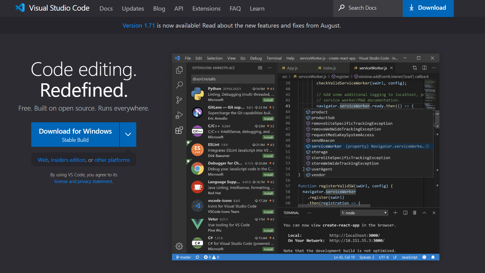
2. Click `Download for Windows`
3. Click the downloaded file to install Visual Studio Code
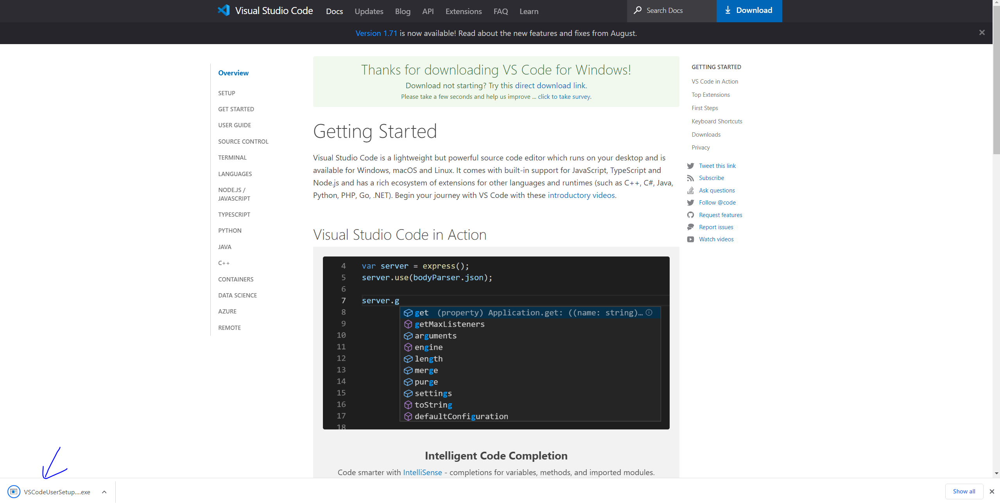
4. After installation, open VS Code and you should see something like this:
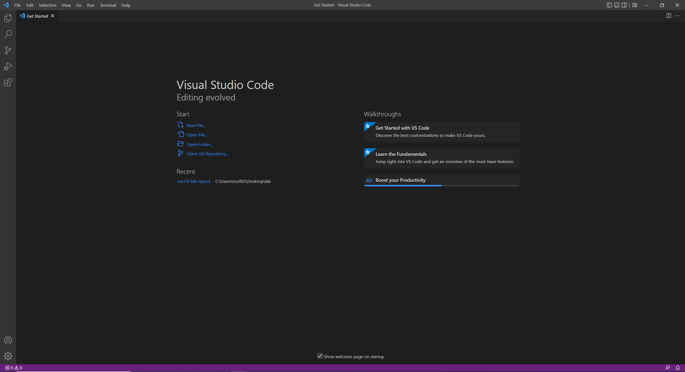

## Grab UCSD CSE15L Course-Specific Account
1. Head to [here](https://sdacs.ucsd.edu/~icc/index.php) to lookup your course-specific account with your triton link ID and your student ID number.
2. For first-time users, you need to reset your password, so go to [here](https://docs.google.com/document/d/1hs7CyQeh-MdUfM9uv99i8tqfneos6Y8bDU0uhn1wqho/edit?usp=sharing) to reset the course-specific account's password.
3. For the tutorial purposes, we call the course specific account ID `X`. In practice, replace `X` with your actual course-specific account ID.
4. Note: It takes around 15 minutes to get your password set so be patient :)


## Remotely Connecting

### Install OpenSSH
If you type `ssh` in your terminal and see anything that relates to an error, you probably need to install `OpenSSH`. You can click [here](https://learn.microsoft.com/en-us/windows-server/administration/openssh/openssh_install_firstuse?tabs=gui) for more information on how to install OpenSSH.

1. Run this command in your console once you have your ssh ready:
```ssh
ssh X@ieng6.ucsd.edu
```
2. You should see a "Password:" feedback like this and at that point, type the password you set for the course specific account `X`. 
    - Note: You will not receive any feedback for the password field input for anything you have typed, so be careful for the typos!
3. Once you typed the correct password, you should be able to log on to the remote computer, it should show something like this:
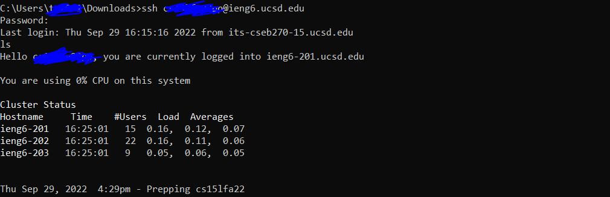
    - Note: You might get confused at this message: ```RSA key fingerprint is SHA256:ksruYwhnYH+sySHnHAtLUHngrPEyZTDl/1x99wUQcec.
      Are you sure you want to continue connecting (yes/no/[fingerprint])?```
      In this case, say `yes` because it generally happens when you connect to the server for the first time, or you connect server from a different computer for the first time. (For the case in UCSD, you should be alarmed when you're trying to connect to your personal machine through SSH)
4. Congratulations! Now you have connected to a lab computer in the CSE department that you can use it for the class!

## Run Some Commands

Now you have connected to the lab computer remotely, you can try running for some commands! For example:
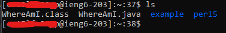

## Moving Files with `scp`
Now you might think "hey, I log on to the lab computer but it is going to be pain to execute source code with `cat` command that we learned in the class". Well, introduce `scp` command!
With `scp`, you can copy the file from your local computer to the remote server that you're connected to easily, just like this:
```ssh
scp [LOCAL FILE 1] [LOCAL FILE 2] [LOCAL FILE X] ... X@ieng6.ucsd.edu:[PATH]
```

For example, let's see I have a Java source file in my current terminal folder that outputs the computer properties:
```java
class WhereAmI {
  public static void main(String[] args) {
    System.out.println(System.getProperty("os.name"));
    System.out.println(System.getProperty("user.name"));
    System.out.println(System.getProperty("user.home"));
    System.out.println(System.getProperty("user.dir"));
  }
}
```
Then I want to upload this file to the remote server, then I can run this:
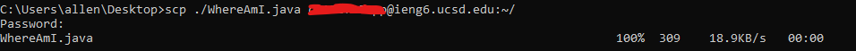

If you see this, then it means you have successfully copied your local file to the remote computer! Yay!

You can check the file by `ssh` into the remote computer and run `ls` command at the root directory (if you uploaded it to root directory, and if not you move your terminal folder to the one you uploaded to with `cd` then you run `ls`)

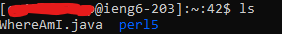

### Bonus: Running Java Files
Remember you just uploaded a `.java` file to the remote computer (well at least in this tutorial I did so I'll assume you did)? We can run that file with `java` and `javac` command!
1. You compile the `.java` file you uploaded with `javac` command 
```ssh
javac WhereAmI.java
```
2. Then you will get a `WhereAmI.class` file in the same directory, run `java` command to run the compiled class file
```ssh
java WhereAmI
```
Then you should see the following terminal output (or similar)
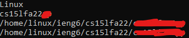

If you see this, congratulations! You just learned how to run a source file on a remote server, which is an essential skill.

## Setting an SSH key
You may think if it is redundant to type out your long password every single time you log on to the remote computer or copy your files. You may also feel insecure about typing your password in front of your classmates and they might accidentally witness your little secret. Well you are not the only one.

***INTRODUCE SSH KEY***

With SSH key, the remote computer will recognize the key you marked for it to "whitelist" and use it as a password except you don't have to type it because the terminal knows where your key is located at.

Start off by typing `ssh-keygen` in your terminal and follow the direction like in this image:
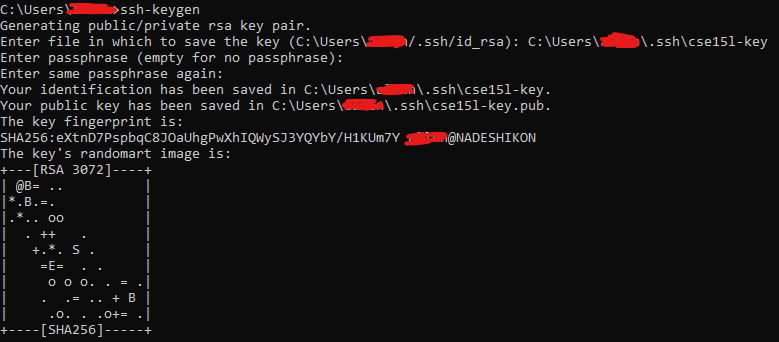
You will find your `ssh` keypair outputted at the designated location (In my case, I have set it to ``[User folder]\.ssh\cse15l-key``)

Then, you can utilize `scp` command we learned earlier to upload your key to the correct location:
```ssh
scp [User folder]\.ssh\cse15l-key.pub X@ieng6.ucsd.edu:~/.ssh/authorized_keys
```
(Note the `.pub`, you only need to upload this because the server only needs your public key to authorize yourself)

### Bonus: Windows Device
If you are on Windows, you need to add your ssh key to the Windows ssh agent to make terminal be able to automatically recognize it:
1. Open Windows Powershell **in administrator**
2. Type these commands:
```ssh
Get-Service ssh-agent | Set-Service -StartupType Automatic
Start-Service ssh-agent
Get-Service ssh-agent
ssh-add $env:USERPROFILE\.ssh\cse15l-key
```
(The path in `ssh-add` needs to be the path where you stored your ssh key pair)
If you see `Identity added: [ssh key path] ([ssh identity])` then it means the key has been successfully added and you can use it to login to your remote computer now!

Now if we log in with `ssh` command, you will notice the prompt that asks for password is gone, just like this:
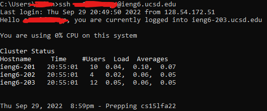

Cheers! You no longer have to type out that long password every single time you try to `ssh` to the remote server!

## Optimize Remote Running
Okay, you might also think "why do I have to type that whole long `X` I can't even remember it", well you are not the only one.
With alias, we can shorten the command even further:

Create a file named `config` (yes, no extension) in your `.ssh` folder with the following content (if you already have one, append the following content):
```
Host [alias name]
  User [X]
  Hostname ieng6.ucsd.edu
```
Alias name can be anything you want, in my case I defined it as `cse15l` because it is short and easy to remember yet unique. Remember to replace `X` with the actual username you received.

Now, you can easily `ssh` into the remote computer with your defined alias, for example:
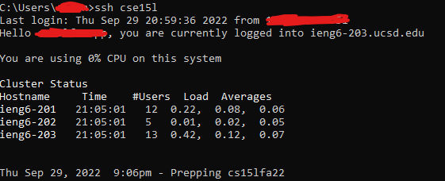

Wow, instead of that long and hard-to-remember username, we only need a single `cse15l` and easy connect! 

Combined with other tricks, you can quickly execute the remote commands such as:
```ssh
ssh cse15l "ls"
scp WhereAmI.java cse15l:~/
ssh cse15l "javac WhereAmI.java; java WhereAmI"
```

## Wrap up
You have learned the fundamentals about how to connect to your individualized remote computer for UCSD CSE 15L class, which is the fundamental for later tasks. Have fun :)