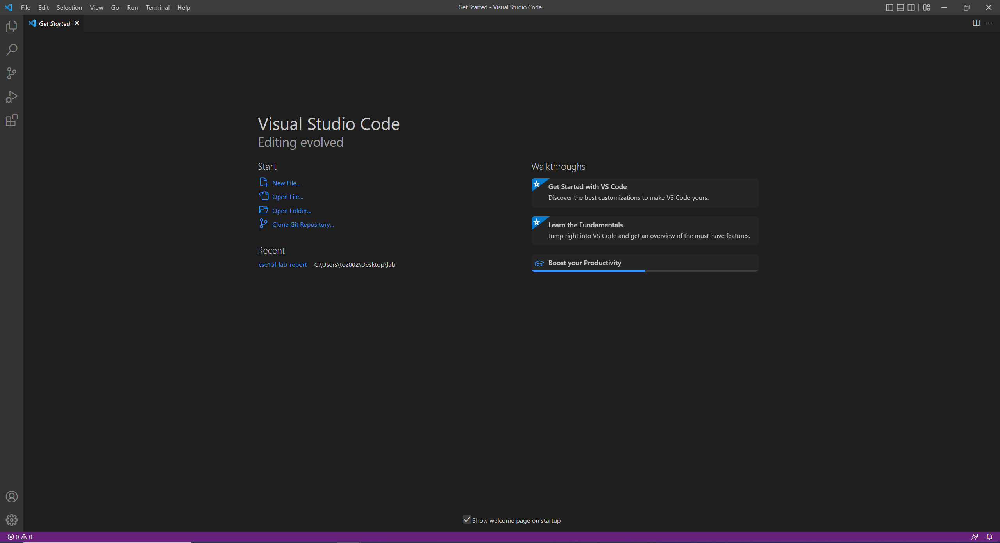

## Install Visual Studio Code

1. Go to Visual Studio Website at https://code.visualstudio.com

2. Click `Download for Windows`
3. Click the downloaded file to install Visual Studio Code

4. After installation, open VS Code and you should see something like this:


## Grab UCSD CSE15L Course-Specific Account
1. Head to [here](https://sdacs.ucsd.edu/~icc/index.php) to lookup your course-specific account with your triton link ID and your student ID number.
2. For first-time users, you need to reset your password, so go to [here](https://docs.google.com/document/d/1hs7CyQeh-MdUfM9uv99i8tqfneos6Y8bDU0uhn1wqho/edit?usp=sharing) to reset the course-specific account's password.
3. For the tutorial purposes, we call the course specific account ID `X`. In practice, replace `X` with your actual course-specific account ID.
4. Note: It takes around 15 minutes to get your password set so be patient :)


## Remotely Connecting

### Install OpenSSH
If you type `ssh` in your terminal and see anything that relates to an error, you probably need to install `OpenSSH`. You can click [here](https://learn.microsoft.com/en-us/windows-server/administration/openssh/openssh_install_firstuse?tabs=gui) for more information on how to install OpenSSH.

1. Run this command in your console once you have your ssh ready:
```ssh
ssh X@ieng6.ucsd.edu
```
2. You should see a "Password:" feedback like this and at that point, type the password you set for the course specific account `X`. 
    - Note: You will not receive any feedback for the password field input for anything you have typed, so be careful for the typos!
3. Once you typed the correct password, you should be able to log on to the remote computer, it should show something like this:

