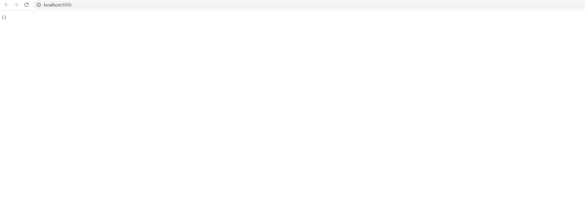
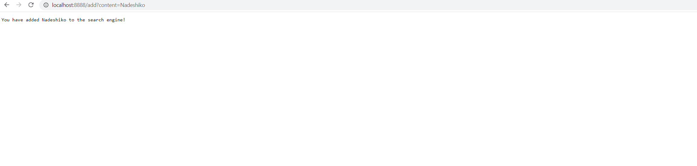
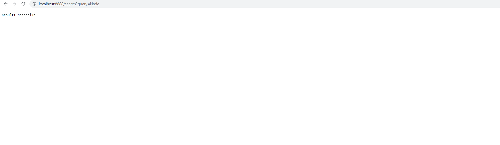

# Lab Report 2 - Week 3

## Part 1
```java
import java.io.IOException;
import java.net.URI;
import java.util.*;
import java.util.function.Function;
import java.util.stream.Collectors;

class SearchEngineURLHandler implements URLHandler {
    List<String> content = new ArrayList<>();
    private static Map<String, Function<URI, String>> HANDLERS = new HashMap<>();

    public SearchEngineURLHandler() {
        HANDLERS.put("/", url -> Arrays.toString(this.content.toArray()));
        HANDLERS.put("/search", url -> {
            String[] rawQuery = url.getQuery().split("=");
            String query = null;
            if (rawQuery.length == 2 && rawQuery[0].equalsIgnoreCase("query")) {
                query = rawQuery[1];
            }

            if (query == null) return "Please enter a valid search query!";

            String finalQuery = query;
            return "Result: " + this.content.stream().filter(c -> c.toLowerCase().contains(finalQuery.toLowerCase())).collect(Collectors.joining(", "));
        });
        HANDLERS.put("/add", url -> {
            String[] rawQuery = url.getQuery().split("=");
            String query = null;
            if (rawQuery.length == 2 && rawQuery[0].equalsIgnoreCase("content")) {
                query = rawQuery[1];
            }

            if (query == null) return "Please enter a valid add action!";

            String finalQuery = query;
            this.content.add(finalQuery);

            return "You have added " + finalQuery + " to the search engine!";
        });
    }

    @Override
    public String handleRequest(URI url) {
        String path = url.getPath();

        Function<URI, String> handler = HANDLERS.get(path.toLowerCase());
        if (handler != null) return handler.apply(url);

        return "404 Not Found!";
    }
}

class SearchEngineServer {
    public static void main(String[] args) throws IOException {
        int port = 8888;

        if(args.length != 0){
            port = Integer.parseInt(args[0]);
        }

        Server.start(port, new SearchEngineURLHandler());
    }
}
```

- The method `Arrays.toString(this.content.toArray())` is being called while trying to query for all of the strings in the list that the search engine server is tracking.
- There is no relevant argument value because it's simply empty, an empty query and empty path is what it needs to trigger a response that returns all tracking strings in the server. The only relevant field in the class is possibly ``content``, the string array because it serves as a mini "database" for search engine server to track the data.
- These values don't change


- The method ``this.content.add(finalQuery)`` is being called while trying to add `Nadeshiko` to the tracker list in the search engine.
- The relevant argument value is ``query`` because it controls whatever is added to the search engine string list. The relevant value in the class is ``content`` because it's the foundation of whatever the search engine server is using to keep track of the string list.
- The value will change depending on the user input, if user wants to add another string, for example, `Kagamihara`, then the ``query`` value will become `Kagamihara` in the URL screenshot.


- The method ``this.content.stream().filter(c -> c.toLowerCase().contains(finalQuery.toLowerCase())).collect(Collectors.joining(", "))`` is ultimately being called to search a certain string among the list of strings that search engine server is currently tracking.
- The relevant argument value is ``query`` because it controls whatever is being searched inside the string list. The relevant value in the class is ``content`` because it's the foundation of whatever the search engine server is using to keep track of the string list.
- The value will change depending on the user input, if user wants to search another string, for example, `shiko`, then the ``query`` value will become `shiko` in the URL screenshot, although it'll return the same value because `shiko` is a part of `Nadeshiko` and that element will be returned from this input as well.

## Part 2
In ``FileExample.java``:
```java
public class FileExample {
    static List<File> getFiles(File start) throws IOException {
        File f = start;
        List<File> result = new ArrayList<>();
        result.add(start);
        if (f.isDirectory()) {
            File[] paths = f.listFiles();
            for (File subFile : paths) {
                result.add(subFile);
            }
        }
        return result;
    }
}
```
- Failure-inducing input: An input that asks to get all files from an existing directory with **more than one level** of subdirectories and/or files.
- Symptom: The method will only return the files from the **first level** of subdirectories and/or files instead of all files.
- The bug: ``for (File subFile : paths) {
  result.add(subFile);
  }``
- The connection between symptom and the bug is that this is simply a one-level-depth for loop that only scans the first-level of subdirectories and files. In this case, if the subdirectory depth is more than 1 but the code only concerns about the first level of subdirectories, the higher-level ones will be simply ignored and thus will not be returned, causing such symptom to occur.

In ``LinkedListExample.java``:
```java
import java.util.NoSuchElementException;

class Node {
    int value;
    Node next;
    public Node(int value, Node next) {
        this.value = value;
        this.next = next;
    }
}
class LinkedList {
    Node root;
    public LinkedList() {
        this.root = null;
    }
    /**
     * Adds the value to the _beginning_ of the list
     * @param value
     */
    public void prepend(int value) {
        // Just add at the beginning
        this.root = new Node(value, this.root);
    }
    /**
     * Adds the value to the _end_ of the list
     * @param value
     */
    public void append(int value) {
        if(this.root == null) {
            this.root = new Node(value, null);
            return;
        }
        // If it's just one element, add if after that one
        Node n = this.root;
        if(n.next == null) {
            n.next = new Node(value, null);
            return;
        }
        // Otherwise, loop until the end and add at the end with a null
        while(n.next != null) {
            n = n.next;
            n.next = new Node(value, null);
        }
    }
    /**
     * @return the value of the first element in the list
     */
    public int first() {
        return this.root.value;
    }
    /**
     * @return the value of the last element in the list
     */
    public int last() {
        Node n = this.root;
        // If no such element, throw an exception
        if(n == null) { throw new NoSuchElementException(); }
        // If it's just one element, return its value
        if(n.next == null) { return n.value; }
        // Otherwise, search for the end of the list and return the last value
        while(n.next != null) {
            n = n.next;
        }
        return n.value;
    }
    /**
     * @return a string representation of the list
     */
    public String toString() {
        Node n = this.root;
        String s = "";
        while(n != null) {
            s += n.value + " ";
            n = n.next;
        }
        return s;
    }
    /**
     * @return the number of elements in the list
     */
    public int length() {
        Node n = this.root;
        int i = 0;
        while(n != null) {
            i += 1;
            n = n.next;
        }
        return i;
    }
}
```
- Failure-inducing input: Initialize a LinkedList, then append these integers in order: 1, 2, 3. Then call ``last()`` method in the LinkedList.
- Symptom: The terminal times out and eventually goes Java Heap Space error.
- Bug: ``while(n.next != null) {``
- The connection between symptom and bug is that this while loop will always have a condition of true because the ``n.next`` is always being set to something that is not null in the while body and thus the ``n.next`` will be always non-null, ultimately leading the while condition to be true forever.

