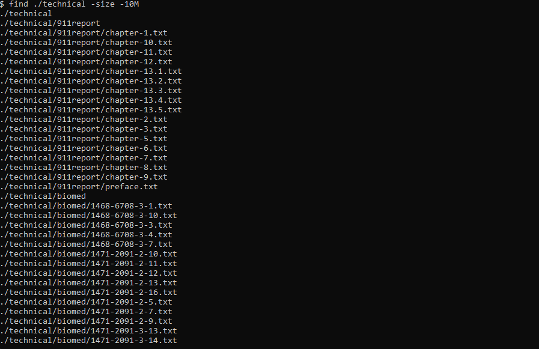

# Lab Report 3 - Week 5

## ``find``

### Option: ``-size``
* Description - Find all files that matches the given file size criteria

Example 1
```bash
find -size 10M
```

This command searches for all files in the current directory and their children directories to see if any file has the size of exactly 10 megabytes. Since the current folder has no file that has the size of exactly 10 megabytes, this command will output nothing.

Example 2
```bash
find ./technical -size +500 -size -10M
```

This command searches for all files in the current directory and their children directories to see if any files have a size between 500 kilobytes and 10 megabytes. There are 5 files that match such condition hence the paths of these files are the output.

Example 3
```bash
find ./technical -size -10M
```

*PS: The output is too long that bash screen cannot fit in*
This command searches for all files in the current directory and their children directories to see if any files have a size under  10 megabytes. It looks like all files in here have size of less than 10 megabytes hence their paths are the output.

### Option: ``-mtime``
This option searches for the files that match the criteria regarding the file's modification time.

Example 1: 
```bash
find -mtime -3
```

This command searches for all files in the current directory and their children directories to see if any file has modified time of 3 days ago or more recent. Since I IDE added these files 2 days ago when I opened it while I cloned this entire project 4 days ago, only these files created by my IDE are returned as output.

Example 2:
```bash
find -mtime +1 -mtime -5
```

This command searches for all files in the current directory and their children directories to see if any file has modified time of between 1 day and 5 days. Since I cloned this project 4 days ago, all the project files are matching this criteria therefore it's returning all files as output (even including ``.git`` files, wow!)

Example 3:
```bash
find -mtime +100
```

This command searches for all files in the current directory and their children directories to see if any file has modified time of 100 days ago or older, since none of the files match this criteria, nothing is returned as output.

### Option: ``-iname``
This option searches for the files that match the criteria regarding the file's names, it matches the names case insensitively.

Example 1:
```bash
find -iname "*cHaPtEr*.txt"
```

This command searches for all files in the current directory and their children directories to see if any file has name that contains "chapter" case insensitively. Since only files in ``911report`` folder have names that contain "chapter", these files are turned as output.

Example 2:
```bash
find -iname "*213x*.txt"
```

This command searches for all files in the current directory and their children directories to see if any file has name that contains "213x" case insensitively. Since there are files in ``biomed`` folder that have names like ``213X`` they will match the criteria because of the case insensitivity.

Example 3:
```bash
find -iname "*1*"
```

This command searches for all files in the current directory and their children directories to see if any file has name that contains "1" case insensitively (and including file extensions!). This is effectively same as without ``-iname`` option because case does not matter when it comes to numbers only. If you use this command in this case, without ``-iname`` tag, it'll return the exactly same result.

