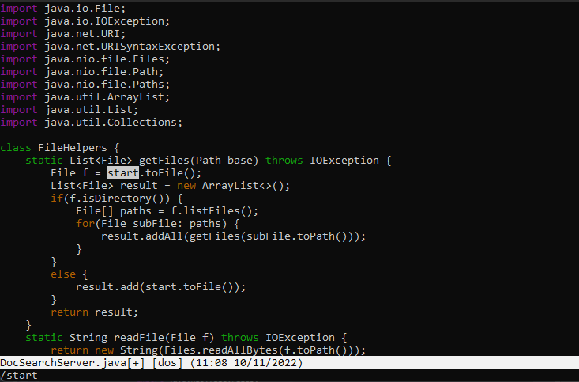

# Lab Report 4 - Week 7

## Part 1
Task: Changing the name of the start parameter and its uses to base

The shortest sequence of **Vim** commands our group found last week was `/start <Enter> i <Delete> <Delete> <Delete> <Delete> <Delete> b a s e (esc) /start (enter) i <Delete> <Delete> <Delete> <Delete> <Delete> b a s e /start (enter) i <Delete> <Delete> <Delete> <Delete> <Delete> b a s e <Esc> :wq`


First, I am searching the first occurrence of string `start` in the file with the command `/`  and query `start`


Then, I enter insert mode while having cursor focused on the first occurrence of the `start` keyword in this method


Then, in the insert mode, I pressed `<Delete>` for 5 times to delete the first occurrence of `start` keyword


Then, I type the word `base` with keys `b a s e` to insert the word `base` to the location we just deleted from



After that, I go back to the normal mode with `Esc` key and then repeated searching with command `/` and keyword `start` to search for next occurrence of the keyword `start` in given method


Repeat of step 3, I pressed `<Delete>` for 5 times to delete the second occurrence of `start` keyword


Repeat of step 4, I type the word `base` with keys `b a s e` to insert the word `base` to the location we just deleted from


Repeat of step 5, I go back to the normal mode with `Esc` key and then repeated searching with command `/` and keyword `start` to search for next occurrence of the keyword `start` in given method


Repeat of step 6, I pressed `<Delete>` for 5 times to delete the third occurrence of `start` keyword


Repeat of step 7, I type the word `base` with keys `b a s e` to insert the word `base` to the location we just deleted from


After removing all occurrences of the word `start`, I press `<Esc>` to return to the normal mode and type `:wq` to save the file and complete the replacements

## Part 2

```
Once, start in Visual Studio Code and make the edit there, then scp the file to the remote server and run it there to confirm it works (you can just run bash test.sh on the remote to test it out). Consider having the appropriate scp command in your command history or easily copy-pasteable!
```
It took me 67 seconds to do so, there was no difficulty for doing it

```
Second, start already logged into a ssh session. Then, make the edit for the task you chose in Vim, then exit Vim and run bash test.sh.
```
It took me 182 seconds to do so, I was having trouble switching between modes

``Which of these two styles would you prefer using if you had to work on a program that you were running remotely, and why?``

I would prefer to use the Visual Studio Code then copy files with `scp` command since I have been using it for a long time and I got used to it

``What about the project or task might factor into your decision one way or another? (If nothing would affect your decision, say so and why!)``

If the task is really simple, like editing 1 or 2 characters of a remote file I would use Vim method because in that case uploading a local file to remote will be slower than editing directly on remote

