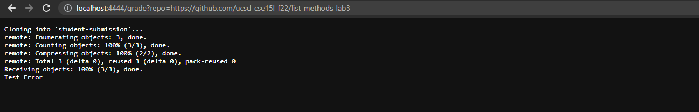
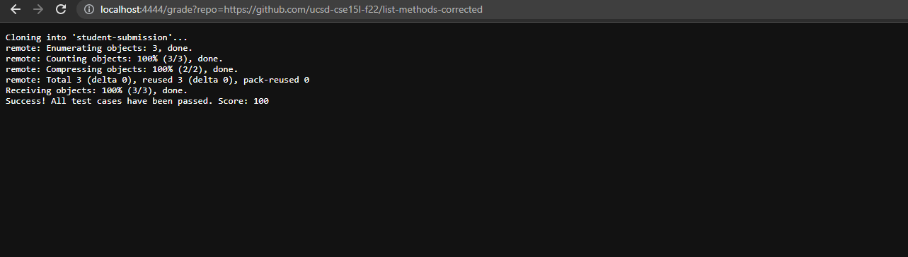
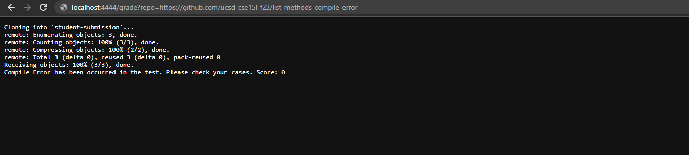

# Lab Report 5 - Week 8

```shell
# Create your grading script here
# set -e

REPO_URL=$1
SUBMISSION_FOLDER=student-submission
FILE=ListExamples.java
COMPILE_ERROR_REPORT_FILE=compile-error.log
EXECUTION_ERROR_REPORT_FILE=error.log

CP=".;lib/hamcrest-core-1.3.jar;lib/junit-4.13.2.jar"

rm -rf student-submission           # Clears previous submission
git clone $REPO_URL student-submission     # Clones new submission to local

if [ ! -f "$SUBMISSION_FOLDER/$FILE" ]; then
  echo "$SUBMISSION/$FILE does not exist"
  exit 1
fi

cp $SUBMISSION_FOLDER/$FILE .

if ! javac -cp $CP ListExamples.java TestListExamples.java 2> $COMPILE_ERROR_REPORT_FILE; then
  echo "Compile Error has been occurred in the test. Please check your cases. Score: 0"
  exit 1
fi


if ! java -cp $CP org.junit.runner.JUnitCore TestListExamples &> $EXECUTION_ERROR_REPORT_FILE; then
  echo "Test Error: Score 0"
  exit 1
else
  echo "Success! All test cases have been passed. Score: 100"
fi
```

``https://github.com/ucsd-cse15l-f22/list-methods-lab3``



``https://github.com/ucsd-cse15l-f22/list-methods-corrected``



``https://github.com/ucsd-cse15l-f22/list-methods-compile-error``



For example of ``https://github.com/ucsd-cse15l-f22/list-methods-corrected``

```shell
rm -rf student-submission           # Clears previous submission
```

This line has no standard output nor standard error. Its return code is 0.

```shell
git clone $REPO_URL student-submission     # Clones new submission to local
```

This line has standard output. Its return code is 0.

```shell
if [ ! -f "$SUBMISSION_FOLDER/$FILE" ]; then
```

This if statement's condition is false because the file ``student-submission/ListExamples.java`` exists in the file system.

The lines
```shell
  echo "$SUBMISSION/$FILE does not exist"
  exit 1
```
won't run because the condition is false.

```shell
cp $SUBMISSION_FOLDER/$FILE .
```

This line has no standard output nor standard error. Its return code is 0.

```shell
if ! javac -cp $CP ListExamples.java TestListExamples.java 2> $COMPILE_ERROR_REPORT_FILE; then
```

This line has standard output but we don't care about that, we only care about standard error which does not happen in this example. Its return code is 0. In this example, the if statement's condition is false

The lines
```shell
  echo "Compile Error has been occurred in the test. Please check your cases. Score: 0"
  exit 1
```
won't run because the condition is false.

```shell
if ! java -cp $CP org.junit.runner.JUnitCore TestListExamples &> $EXECUTION_ERROR_REPORT_FILE; then
```
This line has standard output. Its return code is 0. In this example, the if statement's condition is false

The lines
```shell
  echo "Test Error: Score 0"
  exit 1
```
won't run because the condition is false and thus the line.
```shell
  echo "Success! All test cases have been passed. Score: 100"
```
will run because the condition is false and the statement is in the else block.